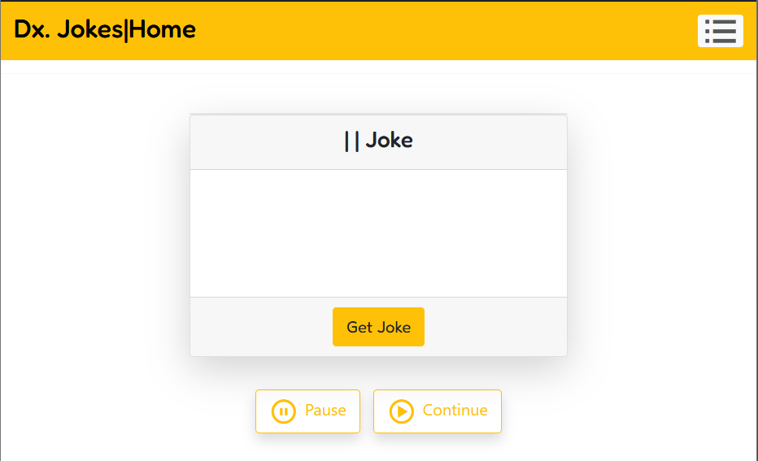

<!DOCTYPE html>
<html lang="en">
<head>
    <meta charset="UTF-8">
    <meta name="viewport" content="width=device-width, initial-scale=1.0">
</head>
<body>
    <h1>Jokes App</h1>
    

    <h2>Click click to get jokes</h2>
    

        
    

</body>
</html>
