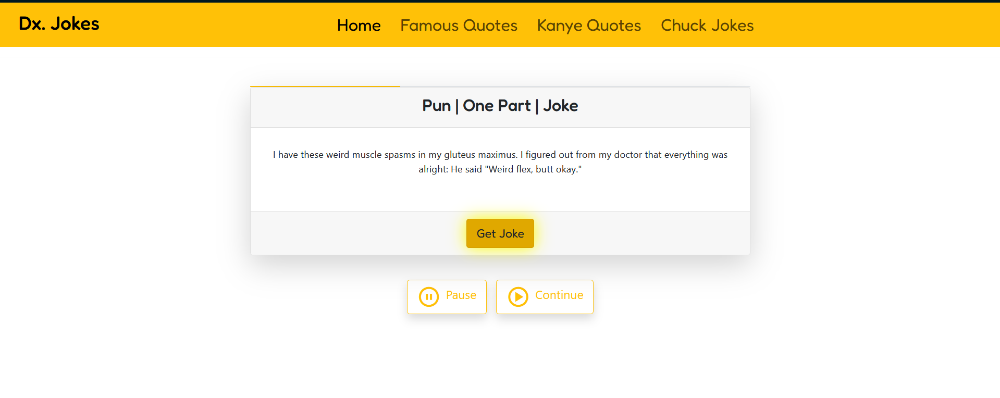

# Dx. Jokes

Dx. Jokes is a fun and interactive web application that allows users to explore and enjoy a variety of jokes and quotes. The platform includes famous quotes, Kanye West quotes, and Chuck Norris jokes, ensuring there’s something for everyone to laugh about.

## Features

- **Famous Quotes**: A collection of inspiring and well-known quotes from historical figures, celebrities, and more.
- **Kanye Quotes**: Unique and entertaining quotes from Kanye West.
- **Chuck Norris Jokes**: Hilarious jokes and puns featuring the legendary Chuck Norris.
- **Random Joke Generator**: A "Get Joke" button to display a random joke or quote.
- **Pause and Continue**: Controls to pause or continue joke generation.

## Installation

1. Clone the repository to your local machine:
   ```bash
   git clone https://github.com/ElvisKemoi/Jokes.git
   ```
2. Navigate to the project directory:
   ```bash
   cd Jokes
   ```
3. Start the development server: Use Live Server extension

## Usage

1. Open your browser and navigate to the development url.
2. Browse through the categories in the navigation bar: `Famous Quotes`, `Kanye Quotes`, and `Chuck Jokes`.
3. Click the "Get Joke" button to fetch a random joke or quote.
4. Use the "Pause" and "Continue" buttons to control joke generation.

## Technologies Used

- **Frontend**: React.js
- **Styling**: CSS for design and layout
- **Backend**: Node.js (optional, for fetching jokes/quotes dynamically)
- **API**: Public APIs to retrieve jokes and quotes (e.g., [Chuck Norris API](https://api.chucknorris.io/))

## Screenshot



## Contributing

Contributions are welcome! To contribute:

1. Fork the repository.
2. Create a new branch for your feature or bug fix:
   ```bash
   git checkout -b feature-name
   ```
3. Commit your changes:
   ```bash
   git commit -m "Add new feature"
   ```
4. Push your branch to your fork:
   ```bash
   git push origin feature-name
   ```
5. Open a pull request.

## License

This project is licensed under the MIT License. See the `LICENSE` file for details.

## Acknowledgements

- [Chuck Norris API](https://api.chucknorris.io/)
- [Kanye Rest API](https://kanye.rest/)
- Public quote sources for famous quotes

---

Have fun and keep laughing with Dx. Jokes!
